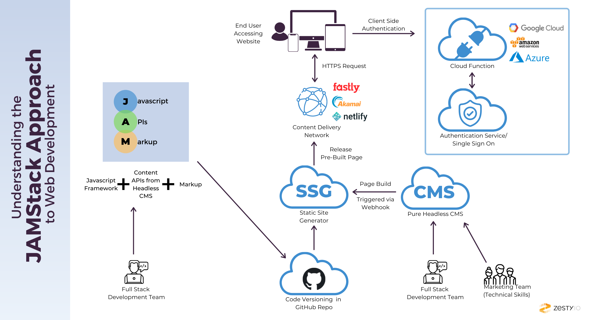
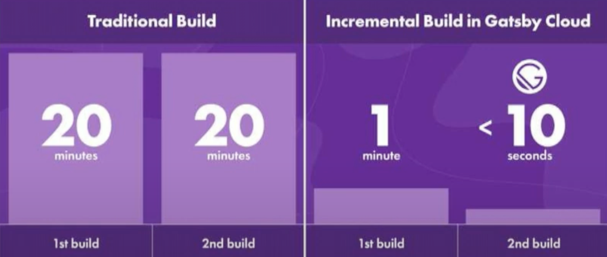
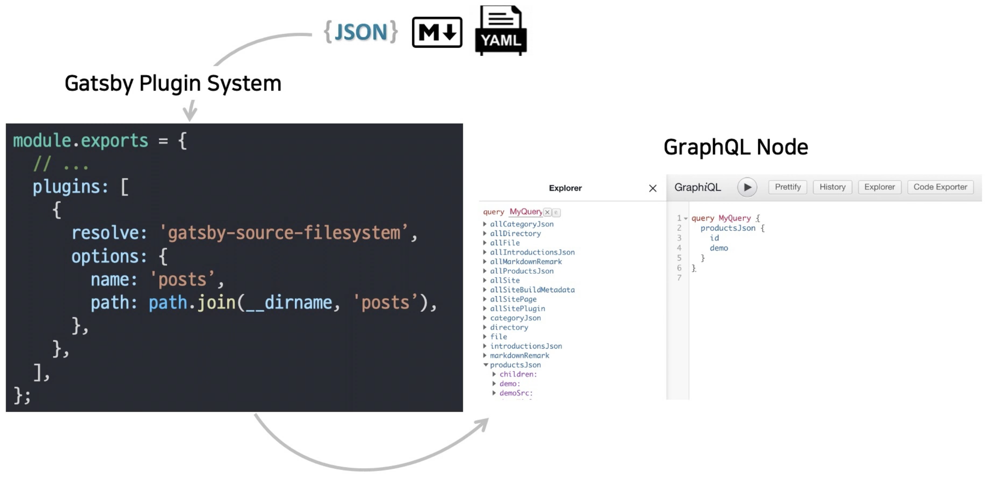
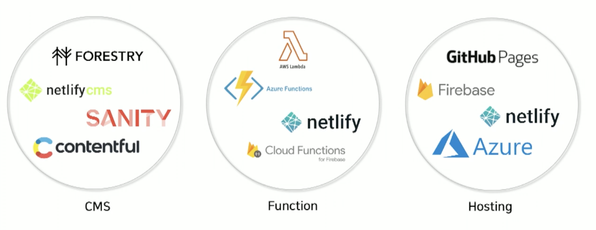
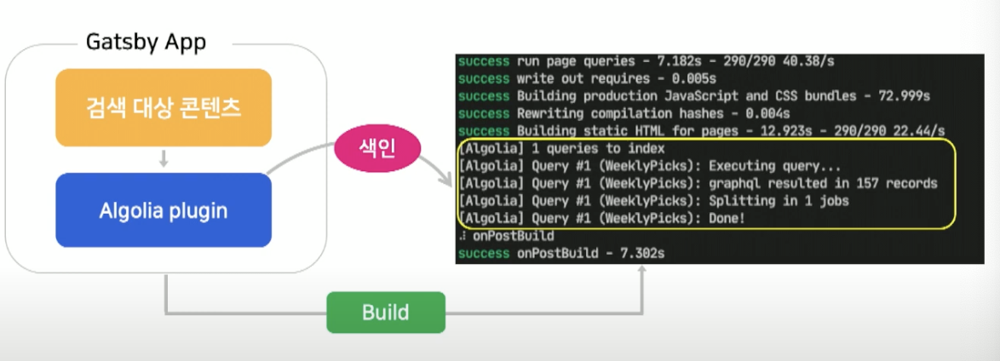

# 웹 개발 구조

## 전통적인 웹

### [DB/CMS ↔ App Server ↔ WEB Server ↔ Browser]

- **DB/CMS:** 데이터베이스나 CMS를 사용하여 필요한 데이터 저장 및 조회
- **App Server:** 다양한 비즈니스 로직 처리
- **Web Server:** HTML 페이지를 만들거나, 이미지/폰트와 같은 정적 자원을 불러옴

  -> **서로 강력하게 의존성이 연결되어 있고, 별도의 Sever를 운영해야하므로 큰 비용이 발생함**

## Serverless

> 서버 시스템을 가상의 클라우드에 두고 운영하는 시스템  
> ex. Serverless 도구 예시: AWS Lamda, Netlify, Firebase

### [Storage ↔ Cloud Funtion ↔ API Gateway ↔ Browser]

- **Storage:** 기존의 DB/CMS를 FaunaDB, DynamoDB와 같은 데이터베이스 관리 서비스로 대체
- **Cloud Function:** Function 단위의 API들이 기존의 App Server 대체하여 비즈니스 로직 처리 ex. AWS Lamda, Netlify

  -> **별도의 Server를 운영하지 않아도 되므로, 비용 감소**
  -> **Serverless 구조에서 파생된 아키텍쳐, “JAM Stack”**

 

---

 

# JAM Stack

## 용어 정리

**Javascript**

- 동적인 요소 처리
- Front-end 라이브러리, 프레임워크
- API 요청

**API**

- 서버 또는 DB에 담당하던 역할
- 추상화된 **재사용 가능한 API**
- Cloud Function, Third party APIs

**Markup**

- 문서 내용의 시각적 표현
- 빌드 시 페이지 생성 **(Prebuilt Pages)**

## JAM Stack 구조

1. 정적 사이트 생성기로 빌드시, Prebuilt Pages를 생성
   1. 개발자가 SSG 도구를 직접 핸들링하여 Prebuilt Page를 만듦
   2. 비개발자 직군에서 HeadlessCMS를 활용하여, Prebuilt Page만드는 트리거 또는 웹훅을 날림
2. 만들어진 Prebuilt Pages를 CDN에 캐싱
3. 캐싱된 정적 자원들은 Browser(사용자)에게 제공
4. 별도의 추상화된 함수나 서비스들(ex. AWS Lamda, Firebase)을 사용해서 API들을 호출함
   

## JAM Stack 특징

### 높은 안정성

- 정적인 페이지이므로, 동적으로 변경되는 부분이 적음
- 서버나 DB가 실행될 필요가 없으므로, 공격에 노출되는 범위가 적음

### 빠른 성능

- 보여줄 컨텐츠들이 Prebuilt Pages에 의해 미리 만들어져있음
- CDN을 통해 빠르게 Browser에 전송

### 확장성 및 낮은 비용

- CDN을 통해 전세계 어디든 확장 가능
- 정적인 HTML 페이지의 호스팅 비용은 매우 저렴 또는 무료

### 쉬운 자동화

- 빌드 산출물이 단순한 정적페이지들이므로, 배포 과정이 매우 단순
- 개발자들이 배포 과정을 쉽게 이해하고 자동화활 수 있음

 

---

 

# 정적 사이트 생성기(SSG)

> Prebuilt Page를 만드는 사이트 생성기  
> ex. Gatsby.js(React), Next.js(React), Nuxt.js(Vue), Jekyll(Ruby)

## 성능에 따른 SSG (점진적 빌드 - ISG)

## 목적에 따른 SSG 선택

### NextJS

- 데이터가 수시로 변경되는 경우
- 동적 페이지가 많은 경우

### GatsbyJS

- JASM Stack을 적극 활용하는 경우
- 페이지 수가 많지 않으며, 빠르게 개발해야되는 경우
- 다양한 Headless CMS 선택지가 필요한 경우
  

 

# JAM Stack 생태계

> 공식 사이트 : https://jamstack.org/

## 동적 컨텐츠

JAM Stack은 pre built pages(정적 페이지)를 미리 생성해서 제공하고 있음

→ 그렇다면, 동적인 컨텐츠는 어떻게 제공할 수 있을까?

**예시**

- 검색결과 페이지
- 상품 상세 페이지

**해결 방법**

- 동적으로 생성될 페이지들을 모든 경우의 수를 따져, 미리 만들어 놓는다. → 예측 불가능하므로, 사실 불가능
- Third party APIs 를 사용한다.
- ex. Algolia : 검색 API 서비스

## Gatsby + Algolia (동적인 검색 페이지 생성하기)

- Gatsby의 Algolia 플러그인을 사용
- 빌드시, 검색 대상인 콘텐츠들을 미리 Aloglia 클라우드에 올려놓음
- 오른쪽 이미지 처럼, 색인된 데이터들을 Aloglia 대시보드에서 확일 할 수 있음

