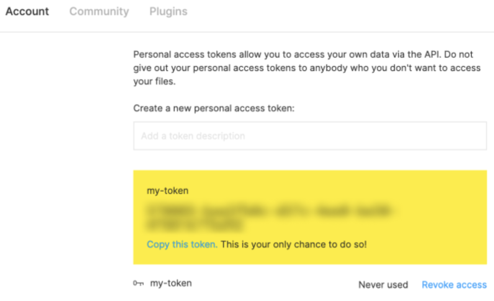
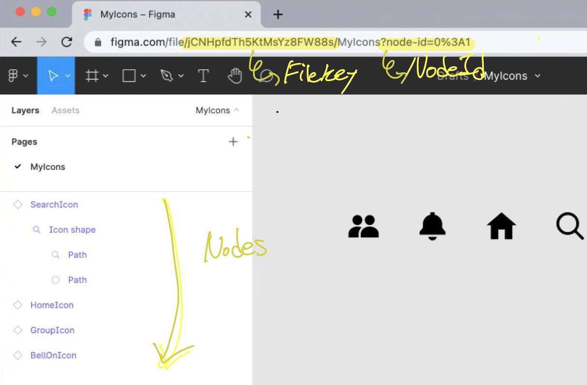
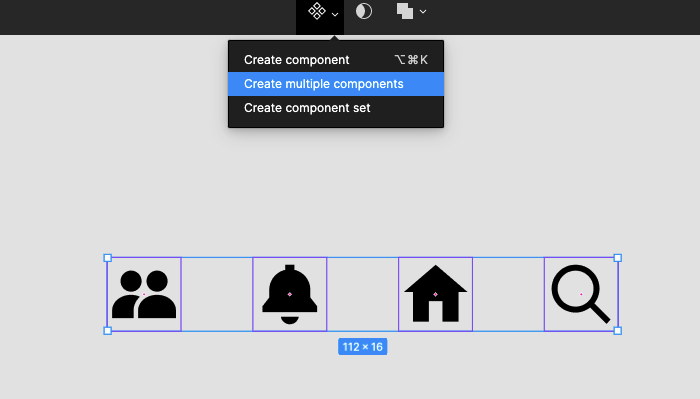
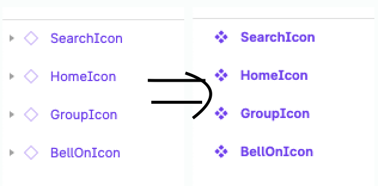

이번에는 사내에서 [Figma API](<(https://www.figma.com/developers/api#intro)>)를 활용해 Figma에 정의된 아이콘들을 추출하고 관리하는 워크플로우 경험을 공유하고자 한다.

필자의 회사에서는 디자인 시스템이 존재한다. 디자이너분들은 Figma 디자인 시스템에 여러 Foundation(`icon`, `typography`, `space`, ..)과 Component들을 정의해놓았다. 여러 Foundation들 중에 가장 많은 양과 크기를 차지하는 것은 단연 `icon`들이다.

아이콘을 시안 단에서 사용하는 워크플로우는 대충 이렇다.

**디자이너**

1. Figma 디자인 시스템 파일에 NewIcon 추가
1. 시안 단에서 Figma 디자인 시스템 파일의 Icon을 import 해서 사용

**개발자**

1. 개발자는 새롭게 추가된 NewIcon을 시안 개발 중 발견
1. 디자인 시스템 개발 패키지에 NewIcon 추가
1. 개발 패키지 릴리즈
1. 릴리즈된 개발 패키지 install 후, NewIcon 컴포넌트를 import 해서 사용

해당 과정에는 여러 Pain Point들과 휴먼에러가 발생한다. 이를 개발 팀장님과 얘기했고, 팀장님의 조언과 함께 해당 문제를 해결하기로 마음 먹었다.

> 원래 기존에 있는 사람들은 기존 프로세스가 불편한지 몰라요. 뉴비들의 새로운 눈으로 당연한 걸 당연하게 생각하지 않고, 해결하려는 시도가 중요해요 !

<br/>
<br/>

## 기존 작업의 Pain Point

---

### 개발자의 단순 반복 작업 업무

개발자는 새로운 아이콘을 발견할 떄마다, 아래와 같은 작업을 단순 반복한다.

1. Figma에서 Icon SVG 추출
1. SVG 코드 복사
1. Storybook에 JSX 형태로 변환
1. Storyboo에 스토리 파일 생성
1. 개발 패키지 릴리즈
1. 시안 단에서 새로운 개팔 패키지 install 후, 사용

### 휴먼 에러

- Figma에 정의된 Icon들과 개발 패키지에 정의된 Icon들은 완벽하게 동기화되지 않은 문제

  (ex. Figma에 있는 아이콘은 292개, 개발 패키지에는 285개)

- Figma에서 개발 패키지로 옮기는 과정 속에서 컴포넌트 명을 오타로 기입하는 문제

  (ex. FatchIcon <-> FetchIcon)

<br/>
<br/>

## 사전 작업 (Figma 단 작업)

---

나는 문제를 해결하기 위해 목표를 세웠고, 목표를 해결하기 위해 **Figma 단의 작업**과 개발 패키지를 관리하는 **Storybook 단의 작업**을 분리해 해결했다.

> - 목표1: Figma에 정의된 모든 아이콘을 개발 패키지에 동기화 시키자.
> - 목표2: 아이콘 동기화 과정을 Script화 하자.

### STEP 1 : Figma Token 생성

Figma REST API를 사용하기 위해서는 개인 토근 값이 필요하다. Figma 토큰은 아래 과정을 통해 생성 가능합니다.

Profile(Avatar) 클릭 > settings 클릭 > Account 클릭 > Personal access tokens



### STEP 2 : file key값과 node id 확인

Figma에서 시안 작업을 하려면, `New Design File`을 통해 하나의 파일을 생성하게 된다. 이 파일 하나가 생성될 때마다 `file key`값이 부여된다.

또한, 왼쪽에 파일트리 형식으로 계층형 구조의 구조물들이 생기게 되는데, 이 구조물들 하나 하나를 `node`라고 부른다. 각각의 Node들에는 `node id`가 부여된다.

`file key`와 `node id` 값은 상단 이미지에서 보이듯이 URL에서 확인이 가능합니다. 각각의 `node` 들을 클릭할 때마다 URL에서 `NodeId` 값이 바뀌는 것을 확인할 수 있습니다.



### STEP 3 : 아이콘들을 모두 컴포넌트 정의하기

Figma API 를 통해 Figma에 정의된 node들을 불러오게 되는데, 이때 node들을 보다 쉽게 관리하기 위해서는 node들의 type을 지정해주는게 좋다.

각각의 node들은 `DOCUMENT`, `CANVAS`, `TEXT`, `COMPONENT`와 같은 여러가지 type들을 가질 수 있다. ([figma types](https://www.figma.com/developers/api#node-types))

나는 아이콘들을 아래 이미지와 같이 모두 `COMPONENT`로 정의해주었다.





> Tip: Figma에서 여러 개 node 들을 한꺼번에 컴포넌트로 변경하려면, `Create multiple components` 기능을 사용하면 편하다. (좌: `INSTANCE`, 우: `COMPONENT`)

### STEP 4 : 아이콘 생성 룰 정하기 (for 디자이너)

아이콘 추출 작업은 AI가 해주는게 아니다. API를 활용한 단순 추출 작업이므로, 정해지 규칙이 없으면 일관된 결과물을 얻을 수 없다.

그래서 나는 디자이너분들에게 아래와 같은 규칙을 지킬 수 있도록 부탁드렸다.

> 1. **아이콘은 Figma 한 파일에서 관리합니다.**
> 1. **아이콘은 동일한 사이즈로 제작합니다.** -> 동일한 `viewBox` 사이즈 유지하기 위함
> 1. **한가지 color만 사용합니다.** -> SVG를 React 컴포넌트로 만들기 위함
> 1. **아이콘의 이름은 PascalCase로 표기합니다.** -> API를 통해 아이콘을 추출할 떄, Figma에 정의된 이름이 곧 컴포넌트 이름이기 떄문에

<br/>
<br/>
<br/>

## 아이콘 추출 (Storybook 작업)

---

### STEP 1 : 데이터 내려받기

사전 작업을 통해 얻어 놓은 `file key`와 `node id`를 활용해, Figma Get Files 엔드 포인트에 접근해 Json 데이터를 내려 받는다.

API를 요청하기 위해서는 HTTP Request Header에 figma token을 실어 보내야한다.

```javascript
// scripts/figmaApi.js
const api = require('axios');

const FIGMA_TOKEN = 'xxx-xxx-xxx'
const FILE_KEY = 'xxx-xxx-xxx'
const NODE_ID = 'xxx-xxx-xxx'

const headers = {
  'X-FIGMA-TOKEN': FIGMA_TOKEN,
}
const figmaFiles = () =>
  api.create({
    baseURL: `https://api.figma.com/v1/files/${FILE_KEY}/nodes?ids=${NODE_ID}`,
    headers,
  })

const getDocument = async () => {
  const { data } = await figmaFiles().get()

  return data
}
```

Figma API는 Figma file key에 해당하는 모든 node들의 정보를 json 형태로 내려준다. json 데이터는 nodes > document > children 의 계층형 구조로 되어있다. 이는 Figma의 사이드 바의 계층형 구조와 같은 구조이다.

```json
{
  "name": "MyIcons",
  "nodes": {
    "2:2": {
      "document": {
        "id": "2:2",
        "name": Frame 1",
        "type": "FRAME",
        "blendMode": "PASS_THROUGH",
        "children": [
          {
            "id": "2:4",
            "name": "Rectangle 1",
            "type": "RECTANGLE",
            "blendMode": "PASS_THROUGH",
            "absoluteBoundingBox": {
            //...
```

### STEP 2 : 아이콘 필터링하기

사전에 데이터 파싱을 용이하게 하기 위해 node type들을 모두 `COMPONENT`로 정의해 두었다.  javascript의 filter 함수를 활요해 Document 내에 `COMPONENT` 필터링 해준다.

1. Figma 최상단인 Document를 불러온다.
1. Document 내에서 특정 node id에 접근한다.
1. node id 내에서 type이 `COMPONENT`인 것만 filter 한다.

```javascript
// scripts/figmaApi.js

// ...
const getComponents = async () => {
	const document = await getDocument(FILE_ID);
	const nodeId = decodeURIComponent(NODE_ID);

	return document.nodes[nodeId].document.children
		.filter((child) => child.type === 'COMPONENT')
		.map((frame) => {
			return {
				name: frame.name,
				id: frame.id,
			};
		});
};

/* getComponents return 예시
 [
	0: {name: 'VscodeIcon', id: '226:0'}
	1: {name: 'UserMoveIcon', id: '155:84'}
	2: {name: 'TableFilterIcon', id: '150:1'}
 ]
*/
```


### STEP 3 : SVG 추출하기

지금까지 GET File 엔드 포인트에 접근해 해당 파일에 정의된 아이콘들의 node id 값들을 모두 획득했다. 이제는 [GET image](https://www.figma.com/developers/api#get-images-endpoint) 엔드 포인트에 접근해 해당 node id 값들의 이미지 데이터를 내려 받는다.

```javascript
// scripts/figmaApi.js

//...

// (1) GET image : getComponents에서 얻은 node id 배열을 활용하여 다시 Fetch 작업을 진행한다.
const getSvgData = async () => {
  const componets = await getComponents(fileId)
  const ids = componets.map(comp => comp.id).join(',')
  const total = componets.length

  // NOTE: id값들을 ,로 join하여 string으로 변환한 뒤, api를 호출하면 svg 데이터를 객체로 한 번에 받을 수 있다.
  const { data } = await figmaImages.get(
    `?ids=${ids}&format=svg&svg_include_id=false`,
  )
  const { images } = data

  return {
    total,
    datas: componets.map(component => {
      return {
        id: component.id,
        name: component.name,
        url: images[component.id],
      }
    }),
  }
}
```

### STEP 4: Storybook에 아이콘 추가하기

Figma에 정의된 모든 아이콘들은 SVG로 추출되고, 해당 SVG들은 스토리북에서 시각적으로 확인하기 위해 스토리들을 만들어주었다.


1. 해당 과정을 통해 받은 SVG들은 **JSX 템플렛**을 통해 JSX로 변환된다.
1. 변환된 JSX들은 `componnets/icons` 하위에 저장된다.
1. 저정된 Iocn 컴포넌트들은 **Story 템플렛** 통해 Story가 만들어진다.
1. 새로 수정/생성된 파일들을 git에 올리고 commit 한다.
1. commit 된 git log들은 PR로 올라간다.


## 결과

해당 script를 통해 디자이너들이 피그마에 정의한 292개의 아이콘을 Storybook으로 완벽히 동기화시킬 수 있다. 

업무 외 시간을 들여, 불편함을 기술로 해결하여 동료들에게 이로운 시스템을 제공했다는 개인적인 뿌듯함을 얻을 수 있었다.