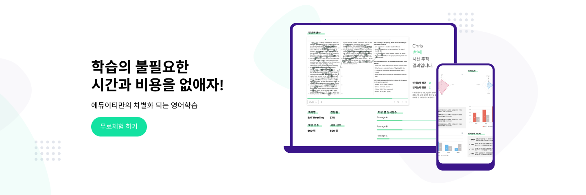

# 블로그를 시작한 이유

> 나는 2019년 하반기부터 공동창업자 2명과 창업 전선에 뛰어들었다. 창업을 하면서 예비창업패키지 합격, 청년창업사관학교 합격, 그리고 여러 상들을 받으면서 뿌듯함과 동시에 자만감이 들기 시작했다. 그러나, 우물 안의 개구리였다. 창업은 매출 찍기까지 실패하게 되었고, 자본금은 바닥이 났다. 이후, 이직을 준비하면서 많은 회의감이 들었다. 이러한 회의감이 들게 된 이유에 대해서 적어본다.

 
 

## 1. 창업의 시작

### 설레이는 시작

2019년 9월, 지금의 CEO이자 기획자였던 오래된 친구가 연락을 해왔다. 친구는 개발 전공이 아니였기 때문에 에듀테크 사업을 하기 위해 나에게 조언을 구해왔다. 이후, 지속적인 소통이 이어지면서, 자연스럽게 해당 아이템에 대해 관심과 애정이 생기게 되었고, 결국 2019년 11월에 공동 창업을 하기로 하였다. 처음에는 사업계획서와 아이템 소개 페이지를 만들었고, 백엔드 개발자를 추가로 영입하게 되었다. 이후 2020년 3월, 우리는 서울대학교 창업 인큐베이팅 프로그램에 합격하면서 본격적으로 사무실을 얻었고, 나는 풀스택 개발자로서 서비스 개발을 시작하였다.

### 뼈아픈 창업 실패

나와 공동 창업자 2명은 거의 같이 살다시피 하였다. 주말은 무조건이며, 공휴일도 화상 회의를 통해 만났다. 결과적으로, 심사위원들의 마음을 사로잡을 수 있었지만, 소비자들의 마음은 사로 잡을 수 없었다.
우리의 아이템은 SaaS 기반 [LMS(학습관리시스템)](https://ko.wikipedia.org/wiki/%ED%95%99%EC%8A%B5_%EA%B4%80%EB%A6%AC_%EC%8B%9C%EC%8A%A4%ED%85%9C)로써, B2B 학원 원장 선생님들을 타겟팅하였다. 그러나 SaaS 시스템이라고 하기에는 많은 문제가 있었다.

>

- 전문 DBA의 부재
- 적은 양의 학습 콘텐츠
- 비즈니스 프로세스 간소화에 실패한 UX

이외에도, 코로나로 인해 하락한 학원 원장 선생님들의 소비력과 같은 환경적인 요인이 등장하면서 우리는 자본금 바닥과 함께 실패를 맞이하였다.

 
 

## 2. 새로운 도전

### 착각의 시작

나는 창업을 하면서 내가 평소에 다루어보고 싶던 프레임워크 및 라이브러리를 마음껏 핸즈온 해보았다.

React, Redux, Redux-saga 등의 최신 프레임워크들을 사용하여 서비스 배포까지 이루어냈다. 또한, 예비창업패키지와 청년창업사관학교 등에 합격하면서 자만심은 높아지고, 착각의 늪에 빠지게 되었다.

> 나도 이제,

- 최신 프레임워크 사용이 가능한 풀스택 개발자 !
- 여타 스타트업들이 요구하는 우대사항을 만족하는 진취적인 개발자 !
- 기획과 디자인이 가능한 유연한 개발자 !
   

### 착각 속의 취업 도전

나는 창업을 통해 배운 여러가지 기술 스택들을 포토폴리오에 작성하였으며, 네카라쿠베당토직 중 3곳에 지원하였다. 나는 세 회사 중 한 회사의 최종 면접까지 갈 수 있었다.

이때까지 나는 위의 3가지가 가능한 개발자라는 것을 마음껏 뽐내며 하나도 긴장하지 않았다. 또한, 인생 첫 지원에서 최종까지 갈 수 있었다는 것을 뿌듯하게 생각하고 있었다. 최종 면접에서의 기술 질문들은 아래와 같았다. (질문은 실제 질문이 아닌, 예시 질문입니다.)

>

- Event Loop에 대해 마음껏 설명할 것.
- 비동기 처리 방식에 대해 아는대로 설명할 것.
- SSR과 CSR의 차이를 렌더링 시점에서 설명해 볼 것.
- 프레임워크나 라이브러리를 가져다 쓰는 것과 직접 만드는 것에 대한 기준점.

이런 식의 추상적인 질문들이 대부분이었다. "마음껏 설명할 것" 즉, 아는 것을 모두 말해보라는 식이었다.

프레임워크의 특징과 같은 정해진 답이 있는 것에는 모두 답변하였지만, 근본적인 질문과 원리를 물어보는 질문에 대해서는 아무 대답을 하지 못했다.
 

### 느낀점

면접이 끝나고 면접관 한 분과 만담을 할 기회가 있었다. 이때 면접관은 나에게 조언을 해주었다.

> "창업을 해본 것은 매우 훌륭한 경험이다. 기획이나 소통 측면에서는 매우 뛰어나시다. Event Loop, DOM 이런 것들이 솔직히 당장 개발하는데 필요하지 않다. 그러나, 이러한 근본적인 기술적 이슈들이 사용자 경험과 직결되는 경우가 많더라. 기술적인 부분도 놓치지 않았으면 좋겠다."

나는 창업을 해본 개발자로서, 누구보다 기획과 UI/UX에 관심이 많으며, 사용자 친화적인 서비스를 만들기 위해 노력한다고 어필하였다.

그러나, 위의 질문과 같은 기술적인 이슈들도 결국에는 **개발자가 챙겨야 하는 "UX"**인 것이다.

나는 프레임워크에 대한 이해 없이 적용만 되면 나의 포토폴리오에 사용 가능 스택으로 추가하기 바빴다. 그래놓고 SPA 프레임워크에 능숙한 프론트 개발자라고 떠들며 다녔다.

그러나 중요한 것은 새로운 툴 또는 최신 프레임워크를 빨리 익히는 것이 아닌, '기본'이었다.

 
 

## 3. 앞으로 해야할 일...

1. 블로그 글 쓰기 -> 근본적인 CS 지식을 기르기에는 블로그에 글정리 하는 것만큼 좋은 것이 없다.
1. 새로운 프레임워크 무작정 쓰기보다는 왜 쓰지는를 생각하면서 쓰기
1. 창업 아이템으로 만들어놓은 레포짓토리 리팩토링하기
   -> 더이상 새로운 프로젝트를 양산하는 것이 아닌, 만들어놓은 것에 디자인 패턴을 적용해 유지/보수에 대한 경험을 쌓자 !
